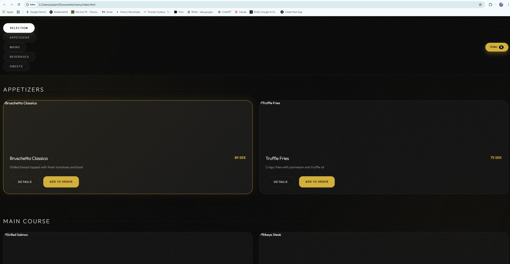

# Customer Experience Demo Script 🎬

Follow these steps to record a professional end-to-end demonstration of your new restaurant system.

## Preparation
1. Open **two windows** side-by-side or on two screens:
   - Window 1: [http://localhost:5173/index.html](http://localhost:5173/index.html) (Customer Menu)
   - Window 2: [http://localhost:5173/dashboard.html](http://localhost:5173/dashboard.html) (Staff Dashboard)
2. Clear demo history on the Dashboard (button at the bottom left).

---

## Step 1: The Arrival (0:00 - 0:10)
- **Customer View**: Scan the QR code (simulated).
- **Action**: Show the elegant splash screen fade into the Home page.
- **Visual**: Highlight the "Demo Restaurant" logo and the premium obsidian design.

## Step 2: Exploration (0:10 - 0:30)
- **Action**: Click "View Menu".
- **Action**: Browse through categories (Appetizers, Mains).
- **Action**: Click "Details" on a premium item (e.g., Ribeye Steak).
- **Highlight**: Point out the **Ingredients** and the **Nutritional Info** (Calorie badge).
- **Interaction**: Scroll down to see the "Recommended with" section.

## Step 3: Selection (0:30 - 0:50)
- **Action**: Add the Steak to the order.
- **Action**: Add a recommended "Craft Beer".
- **Action**: Open the Cart (Bottom Sheet).
- **Highlight**: Show the **⚡ Estimated Energy** calculator updating in real-time.

## Step 4: The Order (0:50 - 1:10)
- **Action**: Click "Send Order Request".
- **Action**: Watch the "Sending..." state and the success toast.
- **Dashboard Sync**: Switch view to the **Staff Dashboard**.
- **Visual**: See the order card slide in instantly with all items and the total price.

## Step 5: Service Request (1:10 - 1:30)
- **Customer View**: Scroll to the bottom of the menu.
- **Action**: Click **"Call Waiter"**.
- **Dashboard Sync**: Switch view to the Dashboard.
- **Visual**: See the amber "Assistance Requested" alert pop up for Table 04.
- **Action**: Dashboard user clicks "Mark as Completed" to show live resolution.

---

## Pro Tips for the Video:
- **Pacing**: Move smoothly; don't rush the animations—they are designed to look expensive.
- **Close-ups**: If possible, zoom in on the Calorie Calculator and the Dashboard alerts.
- **End Scene**: Finish with a shot of both screens together, showing the connected ecosystem.
